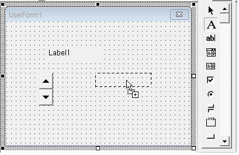

# FDToolBox Spec

<h3><b>Description:</b></h3>
<h4>The Toolbox identifies the controls that you can add to an Userform or Frame or a page of a form.
</h4>

1. If you click the userform edit screen after selecting the icon in the toolbox, the default size control is created. 
2. Create a control by dragging the icon of the toolbox to the userform editing screen.       

3. After you create a control object selected in the selected state returning.       
4. After selecting the control and dragging it in the userform edit window, an area is created. When the mouse is released, the control is created.     
